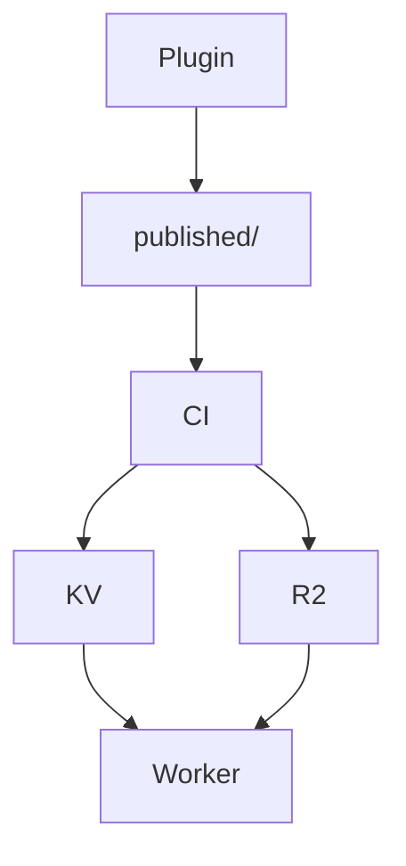

# Math and mermaid

Inline math: $e^{i\pi} + 1 = 0$.

Display math:

$$
\int_{-\infty}^{\infty} e^{-x^2}\,dx = \sqrt{\pi}
$$

A diagram:

Neither may produce a `<script>` tag, and the page must still work with
JavaScript entirely forbidden by CSP (§7.3).
